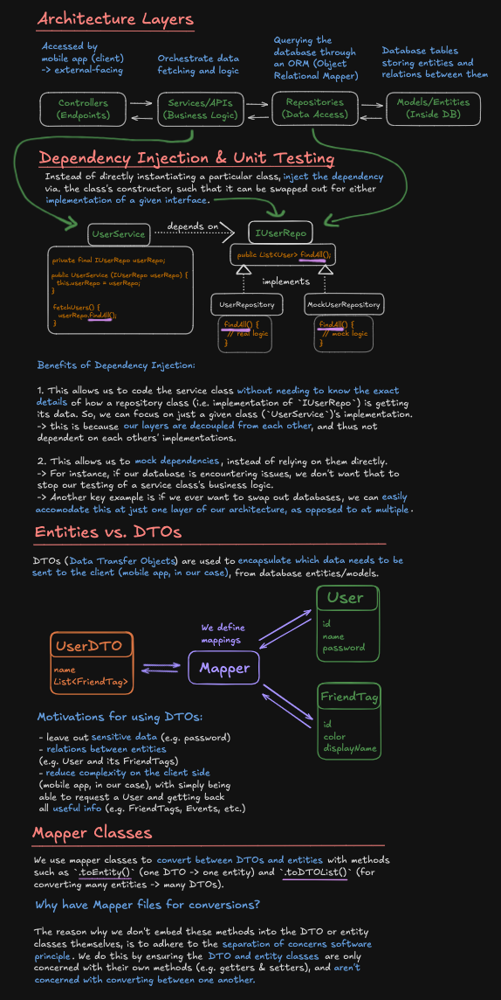
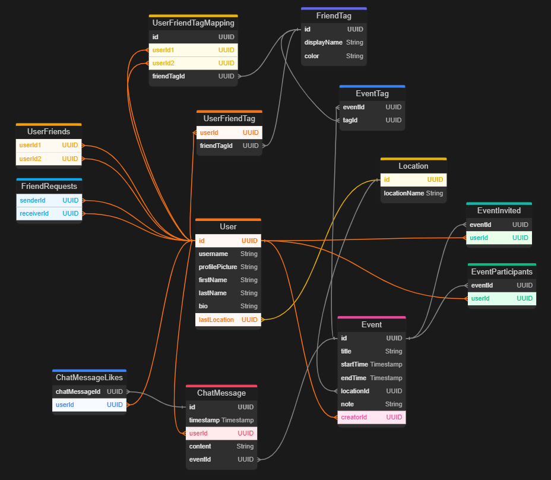

# Spawn-App-Back-End

Back-End Spring Boot REST API for the [Spawn Mobile App](https://github.com/Daggerpov/Spawn-App-iOS-SwiftUI), with a MySQL database, which we interface with through JPA (Java Persistence API).

- [Diagrams](#diagrams)
- [Entity Relationship Diagram](#entity-relationship-diagram)

# Diagrams

# Entity Relationship Diagram

# User DTO Relationships

