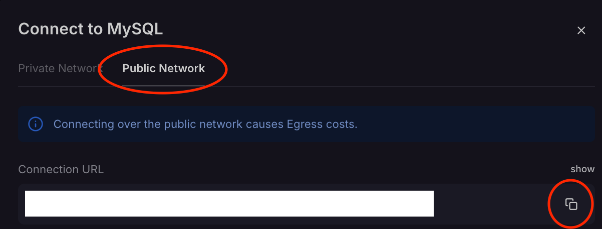
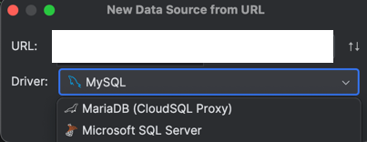

# Spawn-App-Back-End

Back-End Spring Boot REST API for the [Spawn Mobile App](https://github.com/Daggerpov/Spawn-App-iOS-SwiftUI), with a MySQL database, which we interface with through JPA (Java Persistence API).

- [Architecture, Dependency Injection, Testing, & Entities vs. DTOs (+ Mappers)](#architecture-dependency-injection-testing--entities-vs-dtos--mappers)

- [Relationship Diagrams](#relationship-diagrams)
    - [Entity Relationship Diagram](#entity-relationship-diagram)
    - [User DTO Relationships](#user-dto-relationships)

- [Code Explanations](#code-explanations)
    - [Spring Boot](#spring-boot)
    - [JPA (Java Persistence API) & Hibernate](#jpa-java-persistence-api--hibernate)

- [Guides](#guides)
    - [Connecting to Prod (Hosted) DB Through IntelliJ](#connecting-to-prod-hosted-db-through-intellij)
    - [Exporting DB Data to Excel File](#exporting-db-data-to-excel-file)
    - [**Setting Up the `spawn_db` Database Locally**](#setting-up-the-spawn_db-database-locally)

## Architecture, Dependency Injection, Testing, & Entities vs. DTOs (+ Mappers)


# Relationship Diagrams

## Entity Relationship Diagram


## User DTO Relationships


# Code Explanations

## Spring Boot

Spring Boot is our back-end framework with the Java language. It handles the API requests and responses, between our controller, service, and repository layers (see above in [here](#architecture-dependency-injection-testing--entities-vs-dtos--mappers)).

- Spring Annotations
    - `@RestController` tells Spring that this class is a controller, and that it should handle incoming HTTP requests (GET, POST, PUT, DELETE, etc.)
        - We have various mappings for these types of requests, like `@GetMapping`, `@PostMapping`, `@PutMapping`, `@DeleteMapping`, etc.
            - This is also where we specify the path of these requests, along with:
                - `@PathVariable` for URL parameters
                - `@RequestParam` for query parameters
                - `@RequestBody` for the request body (in a POST request, for example)
    - `@Service` tells Spring that this class is a service, and that it should be managed by Spring
    - `@Autowired` tells Spring to inject the dependency (e.g. `EventService` into `EventController`)
    - `@Repository` tells Spring that this class is a repository
- Beans
    - Beans refer to the instantiations of our classes, which get managed by Spring. For example, our service classes, since they are concrete implementations of our interfaces (e.g. `UserService`, being the implementation of `IUserService`), are beans.
    - So, we don't have to manage circular dependencies between classes. For example, since `UserService` takes in `EventService` as a dependency, and vice versa, `EventService` takes in `UserService`, we can annotate them with `@Autowired` to let Spring handle that issue

## JPA (Java Persistence API) & Hibernate

- `@Entity` tells JPA that this class is an entity, and that it should be mapped to a table in the database
- `@Id` tells JPA that this field is the primary key of the table
    - `@GeneratedValue` tells JPA that this field is auto-generated
    - There are also other strategies for generating primary keys, like `GenerationType.IDENTITY`, `GenerationType.SEQUENCE`, etc.
    - For ids of a table, there are also `@EmbeddedId` for composite primary keys, for example in the `EventParticipants` table
- `@Column` is used to specify the column name, length, nullable, etc.
- `@OneToMany` and `@ManyToOne` are used to specify the relationships between entities
- `JpaRepository` is an interface that extends `CrudRepository`, which provides CRUD operations for the entity
    - So, there are pre-defined generic methods like `save`, `findById`, `findAll`, `delete`, etc.
    - We can also define custom queries in the repository interface, by using the `@Query` annotation
        - An example of a custom query is in the `UserRepository` interface, where we find users by their username
        - Also, with custom queries, they can be generated for us by simply naming the method according to JPA standards, like in the `EventRepository` interface, where we find events by their start time using the method, `List<Event> findByCreatorId(UUID creatorId);`

# Guides

Note that for the first two, you'll need access to Railway, so only @ShaneMander, @evannawfal, and I (@Daggerpov) will be able to follow them. The last one (setting up local MySQL database) is for everyone.

<details>

<summary>Connecting to Prod (Hosted) DB Through IntelliJ</summary>

</br>

# Connecting to Prod (Hosted) DB Through IntelliJ


1. Create new data source from URL


2. On Railway -> go to our database's container -> "Data" tab -> click "Connect"


3. Click "Public Network" -> copy the first URL



4. Paste that into the IntelliJ connection window



5. Click "no auth" instead of user/pass login


6. Prepend `jdbc:` to the URL and click "test connection"


7. It should work now, and show the DB tables within IntelliJ here:


</details>


<details>
  <summary>Exporting DB Data to Excel File</summary>
  </br>
  
  # Exporting DB Data to Excel File

  One use case, that I'll use for this guide: beta access sign up emails, for our marketing team.

## Firstly: read `connect-to-prod-db.md`

## Secondly, follow these simple instructions:

1. From IntelliJ's Database panel/tab, expand `{your DB connection name}/railway/tables`:


2. Right-click on the table -> "Import/Export" -> "Export Data to File":


3. You're done with the click of this button


</details>

<details>
  <summary>Setup Local MySQL Database</summary>

  </br>
  
  # Setting Up the `spawn_db` Database Locally

Follow these steps to download, set up the database locally, create `spawn_db`, and populate it with sample data.

---

## **1. Download and Install MySQL**

1. **Download MySQL Community Server**:
    - Visit the [MySQL Downloads Page](https://dev.mysql.com/downloads/mysql/).
    - Choose your operating system and download the installer.
    - Follow the installation wizard steps.
    - Configure the root password during setup and remember it for later use.

2. **(Optional) Download MySQL Workbench**:
    - Visit the [MySQL Workbench Page](https://dev.mysql.com/downloads/workbench/).
    - Install it to have a graphical interface to work with your MySQL server.

---

## **2. Set Up the Database**

1. **Open MySQL Workbench or Terminal**:
    - If using MySQL Workbench, connect to your MySQL server and log in.
    - If using Terminal, log in to the MySQL server by running:
      ```bash
      mysql -u root -p
      ```
    - Enter your root password when prompted.

2. **Create the `spawn_db` Database**:
    - Run the following command to create the database:
      ```sql
      CREATE DATABASE spawn_db;
      ```

3. **Use the `spawn_db` Database**:
    - Run the following command:
      ```sql
      USE spawn_db;
      ```

4. **Ensure Environment Variables are Set**
   - Set the following environment variables, or add to a `.env` file
     - `MYSQL_URL`
     - `MYSQL_USER`
     - `MYSQL_PASSWORD`

5. **Populate the Database with Sample Data**:
    - If you are using the terminal, create a file named `populate_spawn_db.sql` and add the following SQL commands to it:
      ```sql
      -- Use the spawn_db database
      USE spawn_db;
      
      -- Populate Users
      INSERT INTO user (id, username, first_name, last_name, bio, profile_picture) VALUES
      (UNHEX(REPLACE(UUID(), '-', '')), 'john_doe', 'John', 'Doe', 'Loves hiking and coffee.', 'profile1.png'),
      (UNHEX(REPLACE(UUID(), '-', '')), 'jane_smith', 'Jane', 'Smith', 'Digital nomad and bookworm.', 'profile2.png'),
      (UNHEX(REPLACE(UUID(), '-', '')), 'sam_wilson', 'Sam', 'Wilson', 'Coder by day, gamer by night.', 'profile3.png'),
      (UNHEX(REPLACE(UUID(), '-', '')), 'alex_jones', 'Alex', 'Jones', 'Photographer with a passion for travel.', 'profile4.png');
      
      -- Populate Locations
      INSERT INTO location (id, name, latitude, longitude) VALUES
      (UNHEX(REPLACE(UUID(), '-', '')), 'Central Park', 40.785091, -73.968285),
      (UNHEX(REPLACE(UUID(), '-', '')), 'Times Square', 40.758896, -73.985130),
      (UNHEX(REPLACE(UUID(), '-', '')), 'Golden Gate Park', 37.769042, -122.483519),
      (UNHEX(REPLACE(UUID(), '-', '')), 'Eiffel Tower', 48.858844, 2.294351);
      
      -- Populate Events
      INSERT INTO event (id, title, start_time, end_time, location_id, note, creator_id) VALUES
      (UNHEX(REPLACE(UUID(), '-', '')), 'Hiking Adventure', '2024-12-01T08:00:00', '2024-12-01T16:00:00',
      (SELECT id FROM location WHERE name='Central Park'), 'Bring snacks and water.',
      (SELECT id FROM user WHERE username='john_doe')),
      (UNHEX(REPLACE(UUID(), '-', '')), 'Book Club Meeting', '2024-12-05T18:00:00', '2024-12-05T20:00:00',
      (SELECT id FROM location WHERE name='Times Square'), 'Discussing the latest thriller.',
      (SELECT id FROM user WHERE username='jane_smith')),
      (UNHEX(REPLACE(UUID(), '-', '')), 'Photography Workshop', '2024-12-10T10:00:00', '2024-12-10T15:00:00',
      (SELECT id FROM location WHERE name='Golden Gate Park'), 'Learn the basics of DSLR photography.',
      (SELECT id FROM user WHERE username='alex_jones'));
      
      -- Populate Event Participants
      INSERT INTO event_participants (event_id, user_id) VALUES
      ((SELECT id FROM event WHERE title='Hiking Adventure'), (SELECT id FROM user WHERE username='jane_smith')),
      ((SELECT id FROM event WHERE title='Hiking Adventure'), (SELECT id FROM user WHERE username='sam_wilson')),
      ((SELECT id FROM event WHERE title='Book Club Meeting'), (SELECT id FROM user WHERE username='john_doe')),
      ((SELECT id FROM event WHERE title='Book Club Meeting'), (SELECT id FROM user WHERE username='alex_jones'));
      
      -- Populate Event Invited
      INSERT INTO event_invited (event_id, user_id) VALUES
      ((SELECT id FROM event WHERE title='Photography Workshop'), (SELECT id FROM user WHERE username='john_doe')),
      ((SELECT id FROM event WHERE title='Photography Workshop'), (SELECT id FROM user WHERE username='jane_smith'));
      
      -- Populate Friend Tags
      INSERT INTO friend_tag (id, display_name, color) VALUES
      (UNHEX(REPLACE(UUID(), '-', '')), 'Close Friends', '#FF5733'),
      (UNHEX(REPLACE(UUID(), '-', '')), 'Work Friends', '#33FF57'),
      (UNHEX(REPLACE(UUID(), '-', '')), 'Family', '#3357FF');
      
      -- Populate Friend Requests
      INSERT INTO friend_requests (id, sender_id, receiver_id) VALUES
      (UNHEX(REPLACE(UUID(), '-', '')), (SELECT id FROM user WHERE username='john_doe'), (SELECT id FROM user WHERE username='jane_smith')),
      (UNHEX(REPLACE(UUID(), '-', '')), (SELECT id FROM user WHERE username='sam_wilson'), (SELECT id FROM user WHERE username='alex_jones'));
      
      -- Populate User Friends
      INSERT INTO user_friends (id, friend_1, friend_2) VALUES
      (UNHEX(REPLACE(UUID(), '-', '')), (SELECT id FROM user WHERE username='john_doe'), (SELECT id FROM user WHERE username='sam_wilson')),
      (UNHEX(REPLACE(UUID(), '-', '')), (SELECT id FROM user WHERE username='jane_smith'), (SELECT id FROM user WHERE username='alex_jones'));
      
      -- Populate User Friend Tags
      INSERT INTO user_friend_tags (id, user_id, friend_tag_id) VALUES
      (UNHEX(REPLACE(UUID(), '-', '')), (SELECT id FROM user WHERE username='john_doe'), (SELECT id FROM friend_tag WHERE display_name='Close Friends')),
      (UNHEX(REPLACE(UUID(), '-', '')), (SELECT id FROM user WHERE username='jane_smith'), (SELECT id FROM friend_tag WHERE display_name='Work Friends'));
      
      -- Populate User Friend Tag Mapping
      INSERT INTO user_friend_tag_mapping (id, user_1, user_2, friend_tag_id) VALUES
      (UNHEX(REPLACE(UUID(), '-', '')), (SELECT id FROM user WHERE username='john_doe'), (SELECT id FROM user WHERE username='sam_wilson'), (SELECT id FROM friend_tag WHERE display_name='Close Friends')),
      (UNHEX(REPLACE(UUID(), '-', '')), (SELECT id FROM user WHERE username='jane_smith'), (SELECT id FROM user WHERE username='alex_jones'), (SELECT id FROM friend_tag WHERE display_name='Work Friends'));
      ```

6. **Run the Script**:
    - In the terminal, run:
      ```bash
      mysql -u root -p spawn_db < populate_spawn_db.sql
      ```
    - If using MySQL Workbench, paste the script into the query window and run it.

Thats all! You have successfully set up the `spawn_db` database locally and populated it with sample data. You can now use it to test the Spawn application. (hopefully)
   

</details>
