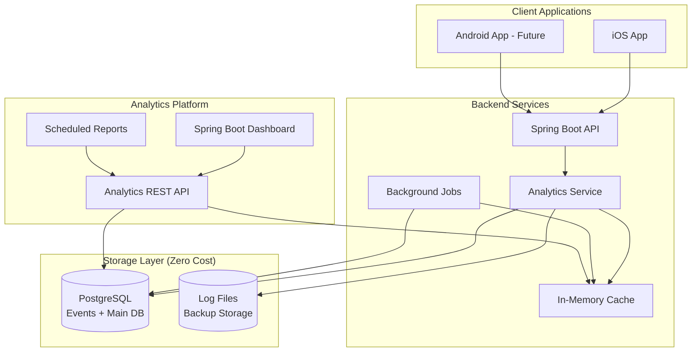

# Analytics System Architecture for Spawn App

## Table of Contents
1. [Executive Summary](#executive-summary)
2. [Current State Analysis](#current-state-analysis)
3. [Analytics Requirements](#analytics-requirements)
4. [Proposed Solutions](#proposed-solutions)
5. [Recommended Architecture](#recommended-architecture)
6. [Implementation Plan](#implementation-plan)
7. [Performance Considerations](#performance-considerations)
8. [Privacy & Compliance](#privacy--compliance)
9. [Monitoring & Alerting](#monitoring--alerting)
10. [Cost Analysis](#cost-analysis)

## Executive Summary

This document outlines a comprehensive in-house analytics system for the Spawn app, designed to track user behavior, app performance, and business metrics while maintaining full data ownership and privacy control.

### Key Objectives
- **User Behavior Analytics**: Track user journeys, feature adoption, and engagement patterns
- **Performance Monitoring**: Monitor app performance, API response times, and error rates
- **Business Intelligence**: Measure key metrics like retention, growth, and feature usage
- **Real-time Insights**: Enable real-time dashboards and alerting
- **Privacy First**: Maintain full control over user data and comply with privacy regulations

### Recommended Solution
A **zero-cost database-driven architecture** with optional real-time capabilities, built entirely using existing infrastructure: PostgreSQL, Spring Boot, Redis (if available), and custom dashboards.

## Current State Analysis

### Existing Analytics Infrastructure
The Spawn app currently has minimal analytics capabilities:

1. **Search Analytics Service** (`SearchAnalyticsService.java`)
   - Tracks fuzzy search performance and patterns
   - In-memory storage with configurable analytics
   - Limited to search-specific metrics

2. **Application Logging**
   - Standard Spring Boot logging
   - User action logging scattered throughout services
   - No centralized event tracking

3. **Notification System**
   - Event-driven notifications for user actions
   - Could be extended for analytics event tracking

### Current App Features Requiring Analytics
Based on codebase analysis, key trackable features include:

#### User Lifecycle
- **Authentication Flow**: Registration, login, OAuth flows
- **Onboarding**: Multi-step onboarding completion rates
- **Profile Management**: Profile updates, photo uploads

#### Core Features
- **Activity Management**: Creation, participation, cancellation
- **Friend System**: Friend requests, acceptances, blocking
- **Search & Discovery**: User search patterns, success rates
- **Chat System**: Message sending, chat participation
- **Location Services**: Location sharing, map usage

#### Engagement Metrics
- **Session Analytics**: Session duration, frequency
- **Feature Adoption**: First-time usage, retention per feature
- **Push Notifications**: Open rates, engagement

## Analytics Requirements

### Functional Requirements

#### 1. Event Tracking
- **User Events**: Login, logout, registration, profile updates
- **Feature Usage**: Activity creation, friend requests, searches, messages
- **System Events**: Errors, performance issues, API calls
- **Business Events**: Conversions, retention milestones, churn indicators

#### 2. Real-time Analytics
- **Live Dashboards**: Current active users, real-time event streams
- **Alerting**: Anomaly detection, error rate spikes, performance degradation
- **Monitoring**: System health, API performance, user experience metrics

#### 3. Historical Analytics
- **Trend Analysis**: Long-term user behavior patterns
- **Cohort Analysis**: User retention and engagement over time
- **A/B Testing**: Feature flag performance and conversion tracking
- **Business Intelligence**: Revenue impact, growth metrics, feature ROI

#### 4. User Journey Analytics
- **Funnel Analysis**: Onboarding completion, feature adoption funnels
- **Path Analysis**: User navigation patterns, drop-off points
- **Session Analysis**: User behavior within sessions

### Non-Functional Requirements

#### 1. Performance
- **Low Latency**: < 10ms event ingestion impact on app performance
- **High Throughput**: Support 10K+ events per second at peak
- **Scalability**: Linear scaling with user growth

#### 2. Reliability
- **Data Durability**: No event loss, at-least-once delivery
- **High Availability**: 99.9% uptime for analytics system
- **Fault Tolerance**: Graceful degradation during outages

#### 3. Privacy & Security
- **Data Anonymization**: PII protection and anonymization options
- **GDPR Compliance**: Right to deletion, data portability
- **Data Retention**: Configurable retention policies
- **Access Control**: Role-based access to analytics data

## Proposed Solutions

### Solution 1: Simple Database-Driven Analytics

#### Architecture
```
Mobile App → Backend API → Events Table → Scheduled Jobs → Dashboard
```

#### Components
- **Event Storage**: PostgreSQL table for event logging
- **Processing**: Spring Boot scheduled jobs for aggregation
- **Visualization**: Custom Spring Boot dashboard or Grafana

#### Pros
- ✅ Simple to implement and maintain
- ✅ Leverages existing PostgreSQL infrastructure
- ✅ Full data control and privacy
- ✅ Low operational overhead

#### Cons
- ❌ Limited scalability for high event volumes
- ❌ No real-time analytics capabilities
- ❌ Manual aggregation and reporting
- ❌ Performance impact on main database

#### Implementation Estimate
- **Development Time**: 2-3 weeks
- **Infrastructure Cost**: $0 (uses existing DB)
- **Maintenance**: Low

### Solution 2: PostgreSQL + In-Memory Analytics (Recommended)

#### Architecture
```
Mobile App → Backend API → PostgreSQL Events Table → Background Jobs → In-Memory Cache → Dashboard
```

#### Components
- **Event Storage**: PostgreSQL table with optimized indexes
- **Processing**: Spring Boot @Scheduled jobs for aggregation
- **Caching**: In-memory maps and optional Redis for real-time metrics
- **Visualization**: Custom Spring Boot dashboard with Thymeleaf/React

#### Pros
- ✅ Zero infrastructure cost (uses existing PostgreSQL)
- ✅ Simple to implement and maintain
- ✅ Real-time capabilities with in-memory caching
- ✅ Full data control and privacy
- ✅ Leverages existing Spring Boot expertise

#### Cons
- ⚠️ Moderate scalability (good for 10K+ users)
- ⚠️ Manual dashboard development required
- ⚠️ Limited advanced analytics without additional tooling

#### Implementation Estimate
- **Development Time**: 3-4 weeks
- **Infrastructure Cost**: $0 (uses existing infrastructure)
- **Maintenance**: Low to Moderate

### Solution 3: File-Based Analytics (Ultra-Lightweight)

#### Architecture
```
Mobile App → Backend API → JSON Log Files → File Processing Jobs → SQLite/H2 → Simple Dashboard
```

#### Components
- **Event Storage**: JSON log files with log rotation
- **Processing**: Spring Boot jobs that parse log files
- **Storage**: SQLite or H2 embedded database for aggregated data
- **Visualization**: Simple HTML/JavaScript dashboard

#### Pros
- ✅ Zero infrastructure cost
- ✅ Ultra-simple implementation
- ✅ No external dependencies
- ✅ Easy to backup and migrate
- ✅ Perfect for prototyping and small scale

#### Cons
- ❌ Limited scalability
- ❌ No real-time capabilities
- ❌ Manual log management required
- ❌ Basic visualization capabilities

#### Implementation Estimate
- **Development Time**: 1-2 weeks
- **Infrastructure Cost**: $0
- **Maintenance**: Very Low

### Solution 4: Extended Search Analytics Pattern

#### Architecture
```
Mobile App → Backend API → Enhanced SearchAnalyticsService → In-Memory Maps → REST API → Dashboard
```

#### Components
- **Event Storage**: Extend existing SearchAnalyticsService pattern
- **Processing**: In-memory concurrent data structures
- **Storage**: Periodic snapshots to JSON/CSV files
- **Visualization**: REST API feeding simple web dashboard

#### Pros
- ✅ Zero infrastructure cost
- ✅ Builds on existing SearchAnalyticsService
- ✅ Real-time capabilities
- ✅ Minimal code changes required
- ✅ Thread-safe concurrent collections

#### Cons
- ❌ Data lost on application restart (unless persisted)
- ❌ Memory usage grows with data
- ❌ Limited historical data retention
- ❌ Single-node limitations

#### Implementation Estimate
- **Development Time**: 1-3 weeks
- **Infrastructure Cost**: $0
- **Maintenance**: Low

## Recommended Architecture

Based on the $0 budget constraint, I recommend **Solution 2: PostgreSQL + In-Memory Analytics** as it provides the best balance of capabilities, zero cost, and maintainability for the Spawn app.

### System Architecture



### Core Components

#### 1. Event Collection Service
**File**: `AnalyticsService.java`

```java
@Service
public class AnalyticsService {
    // Event ingestion
    public void trackEvent(String userId, String eventType, Map<String, Object> properties);
    
    // User identification
    public void identifyUser(String userId, Map<String, Object> traits);
    
    // Page/screen tracking
    public void trackScreen(String userId, String screenName, Map<String, Object> properties);
    
    // Custom metrics
    public void trackMetric(String metricName, double value, Map<String, String> tags);
}
```

#### 2. Event Processing Pipeline
**File**: `EventProcessor.java`

```java
@Component
public class EventProcessor {
    @EventListener
    public void processEvent(AnalyticsEvent event);
    
    // Real-time aggregation
    public void updateRealTimeMetrics(AnalyticsEvent event);
    
    // Batch processing
    @Scheduled(fixedRate = 60000)
    public void processBatchEvents();
}
```

#### 3. Analytics Data Models

**Event Schema**:
```java
@Entity
public class AnalyticsEvent {
    private String eventId;
    private String userId;
    private String sessionId;
    private String eventType;
    private Instant timestamp;
    private Map<String, Object> properties;
    private String platform;
    private String appVersion;
    private String userAgent;
}
```

### Event Taxonomy

#### User Events
- `user_registered` - User completes registration
- `user_logged_in` - User logs in
- `user_logged_out` - User logs out
- `profile_updated` - User updates profile
- `onboarding_step_completed` - User completes onboarding step

#### Feature Events
- `activity_created` - User creates new activity
- `activity_joined` - User joins activity
- `activity_left` - User leaves activity
- `friend_request_sent` - User sends friend request
- `friend_request_accepted` - User accepts friend request
- `message_sent` - User sends message
- `search_performed` - User performs search
- `location_shared` - User shares location

#### System Events
- `app_launched` - App is opened
- `app_backgrounded` - App goes to background
- `screen_viewed` - User views screen
- `api_call_made` - API request made
- `error_occurred` - System error

#### Business Events
- `tutorial_completed` - User completes tutorial
- `feature_first_use` - First time using feature
- `retention_milestone` - User reaches retention milestone

### Data Storage Strategy (Zero Cost)

#### 1. PostgreSQL (Primary Analytics Storage)
- **Purpose**: Event storage, aggregated metrics, and configuration
- **Schema**: Optimized tables with proper indexing for analytical queries
- **Retention**: Configurable data retention with automatic cleanup
- **Tables**: `analytics_events`, `analytics_metrics`, `analytics_sessions`
- **Cost**: $0 (uses existing PostgreSQL infrastructure)

#### 2. In-Memory Cache (Real-time Metrics)
- **Purpose**: Real-time counters, recent events, active sessions
- **Implementation**: Java ConcurrentHashMap, AtomicInteger, synchronized collections
- **TTL**: Configurable cleanup of old data (e.g., 24 hours)
- **Use Cases**: Active users, real-time dashboards, immediate alerts
- **Cost**: $0 (uses application memory)

#### 3. Log Files (Backup & Debug)
- **Purpose**: Event backup, debugging, data recovery
- **Format**: JSON lines with log rotation
- **Storage**: Local filesystem with configurable retention
- **Use Cases**: Data recovery, debugging, offline analysis
- **Cost**: $0 (uses local disk space)

### Dashboard & Reporting

#### Real-time Dashboard Features
- **Live Metrics**: Current active users, events per second
- **System Health**: API response times, error rates
- **User Activity**: Recent registrations, active sessions
- **Feature Usage**: Real-time feature adoption metrics

#### Historical Reports
- **User Analytics**: Registration trends, retention cohorts, churn analysis
- **Feature Analytics**: Adoption rates, usage patterns, feature performance
- **Performance Reports**: API performance, error analysis, system metrics
- **Business Intelligence**: Growth metrics, engagement scores, conversion funnels

## Implementation Plan

### Phase 1: Foundation (Weeks 1-2)
1. **Analytics Service Setup**
   - Create `AnalyticsService` with basic event tracking
   - Set up PostgreSQL analytics tables
   - Implement in-memory caching for real-time metrics

2. **Core Event Tracking**
   - Implement user lifecycle events (login, registration, logout)
   - Add session tracking with in-memory storage
   - Basic error tracking and logging

3. **Simple Dashboard**
   - Create basic Spring Boot Thymeleaf dashboard
   - Display real-time user count from in-memory cache
   - Show recent events from PostgreSQL

### Phase 2: Core Features (Weeks 3-4)
1. **Feature Event Tracking**
   - Activity creation and participation events
   - Friend system events
   - Search and messaging events

2. **Event Processing Pipeline**
   - Implement @Scheduled background jobs for PostgreSQL aggregation
   - Set up in-memory metric calculation and caching
   - Create real-time metric updates using concurrent data structures

3. **Enhanced Dashboard**
   - User analytics views with PostgreSQL queries
   - Feature usage reports with historical data
   - Performance metrics from application monitoring

### Phase 3: Advanced Analytics (Weeks 5-6)
1. **Advanced Features**
   - Funnel analysis using PostgreSQL window functions
   - Cohort analysis with SQL queries and in-memory processing
   - Simple A/B testing framework with feature flags

2. **Alerting System**
   - Basic anomaly detection using statistical thresholds
   - Performance alerts via email/logging
   - Business metric alerts with configurable rules

3. **API & Integration**
   - REST API for analytics data export
   - CSV/JSON export capabilities
   - Webhook integration for external notifications

### Phase 4: Optimization (Weeks 7-8)
1. **Performance Optimization**
   - PostgreSQL query optimization with proper indexing
   - In-memory cache tuning and memory management
   - Automated data retention policies with cleanup jobs

2. **Advanced Dashboards**
   - Interactive charts using Chart.js or D3.js
   - Custom report builder with dynamic SQL generation
   - Scheduled reports via email with PDF generation

3. **Documentation & Training**
   - User guides
   - API documentation
   - Team training

## Performance Considerations

### Event Ingestion Performance
- **Target Latency**: < 5ms overhead per event (in-memory processing)
- **Throughput**: Support 500+ events/second (sufficient for most apps)
- **Batching**: Batch events for PostgreSQL insertion every 30 seconds
- **Async Processing**: Non-blocking event ingestion with background processing

### Query Performance
- **PostgreSQL Optimization**: Proper indexing on timestamp, user_id, event_type
- **In-Memory Caching**: Cache frequently accessed metrics for instant retrieval
- **Query Limits**: Implement query timeouts and pagination
- **Pre-aggregation**: Background jobs compute daily/hourly metrics

### Storage Optimization
- **Data Retention**: Automatic cleanup of events older than 1 year
- **Compression**: PostgreSQL table compression for historical data
- **Partitioning**: Date-based table partitioning for large datasets
- **Indexing**: Composite indexes for common query patterns

## Privacy & Compliance

### Data Privacy Measures
1. **PII Protection**
   - Hash sensitive identifiers
   - Separate PII from analytics events
   - Implement data anonymization

2. **User Consent**
   - Opt-in analytics tracking
   - Granular consent options
   - Easy opt-out mechanism

3. **Data Retention**
   - Configurable retention policies
   - Automatic data deletion
   - Right to be forgotten compliance

### GDPR Compliance
- **Data Minimization**: Only collect necessary data
- **Purpose Limitation**: Clear purpose for each data point
- **Data Portability**: Export user's analytics data
- **Right to Deletion**: Complete data removal capability

## Monitoring & Alerting

### System Health Monitoring
- **Event Ingestion Rate**: Monitor for drops or spikes
- **Processing Lag**: Track event processing delays
- **Storage Usage**: Monitor database growth
- **Query Performance**: Track dashboard load times

### Business Metrics Alerts
- **User Growth**: Alert on significant changes in registration rate
- **Retention**: Monitor retention rate changes
- **Feature Adoption**: Alert on low adoption of new features
- **Error Rates**: Monitor application error increases

### Alert Channels
- **Email Alerts**: Critical issues and daily summaries (using existing email service)
- **Log-based Alerts**: Write alerts to application logs for monitoring
- **Dashboard Alerts**: Visual alerts on dashboards with color coding
- **File-based Alerts**: Write alert files for external monitoring tools

## Cost Analysis

### Infrastructure Costs (Monthly)

#### All Scales (0 to 100K+ active users)
- **PostgreSQL**: $0 (uses existing database)
- **Application Memory**: $0 (uses existing server memory)
- **Disk Storage**: $0 (uses existing server disk space)
- **Processing Power**: $0 (uses existing server CPU)
- **Total**: **$0/month**

### Development Costs
- **Initial Development**: 3-4 weeks of development time
- **Ongoing Maintenance**: ~10% of development time monthly (minimal)
- **Dashboard Development**: Included in initial development

### Resource Considerations
- **Memory Usage**: ~50-200MB additional memory for in-memory analytics
- **Disk Usage**: ~1-10GB additional disk space for event storage
- **CPU Usage**: Minimal impact, mostly during background aggregation jobs
- **Database Load**: Moderate increase, optimized with proper indexing

### ROI Considerations
- **Zero Financial Investment**: No upfront or ongoing costs
- **Data-Driven Decisions**: Improved product decisions
- **User Retention**: Better understanding of user behavior
- **Performance Optimization**: Identify and fix performance issues
- **Business Intelligence**: Growth optimization without external tools

## Migration Strategy

### From Current State
1. **Extend Existing Analytics**: Build on current `SearchAnalyticsService`
2. **Gradual Rollout**: Implement feature by feature
3. **Parallel Running**: Run new system alongside existing logging
4. **Data Validation**: Verify analytics accuracy before full migration

### Rollback Plan
1. **Feature Flags**: Use feature flags for analytics tracking
2. **Dual Writing**: Write to both old and new systems during transition
3. **Quick Disable**: Ability to quickly disable analytics if issues arise
4. **Data Recovery**: Backup and recovery procedures

## Success Metrics

### Technical Metrics
- **System Uptime**: 99.9% availability
- **Event Processing Latency**: < 1 second average
- **Dashboard Load Time**: < 3 seconds
- **Data Accuracy**: > 99% accuracy compared to source systems

### Business Metrics
- **Analytics Adoption**: Team usage of analytics dashboards
- **Decision Impact**: Number of product decisions influenced by analytics
- **Issue Detection**: Time to detect and resolve issues
- **User Insights**: Number of actionable insights generated monthly

## Conclusion

The recommended zero-cost PostgreSQL + In-Memory analytics architecture provides a practical, maintainable solution that grows with the Spawn app while respecting budget constraints. It balances implementation simplicity with powerful analytics capabilities while maintaining full data ownership and privacy control.

Key benefits:
- **Zero Cost**: No additional infrastructure or licensing costs
- **Immediate Value**: Quick implementation using existing technology stack
- **Scalable Growth**: Architecture that handles thousands of users efficiently
- **Full Control**: Complete ownership of analytics data and infrastructure
- **Privacy First**: Built-in privacy and compliance features
- **Spring Boot Native**: Leverages existing expertise and infrastructure

### Why This Approach Works for Zero Budget:

1. **Leverages Existing Infrastructure**: Uses PostgreSQL and Spring Boot you already have
2. **In-Memory Performance**: Real-time capabilities without external caching services
3. **Minimal Complexity**: Straightforward implementation and maintenance
4. **Proven Patterns**: Extends the existing SearchAnalyticsService pattern
5. **Gradual Enhancement**: Can add paid services later as budget allows

The phased implementation approach allows for gradual rollout and validation, minimizing risk while delivering immediate value to the product team without any financial investment.
