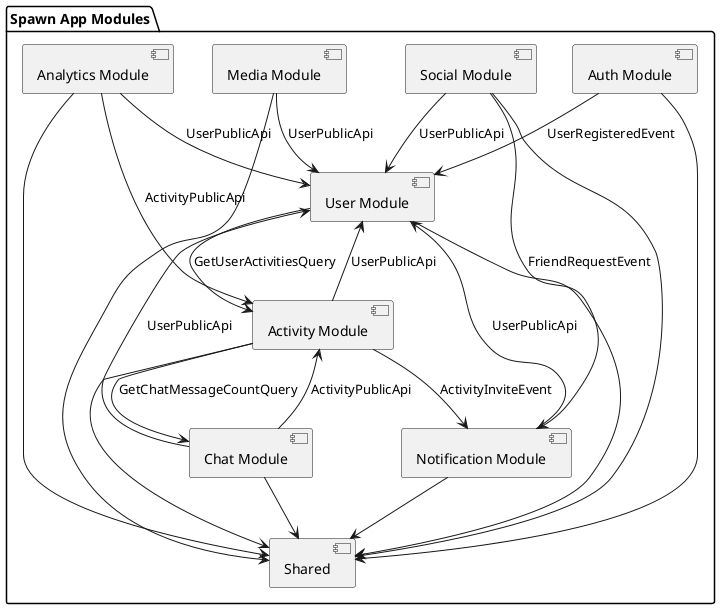

# Spring Modulith Refactoring Plan

**Project:** Spawn App Back-End  
**Goal:** Refactor monolith to Spring Modulith with validated module boundaries  
**Timeline:** 6-8 weeks  
**Next Step:** Microservices extraction (see [MICROSERVICES_IMPLEMENTATION_PLAN.md](../microservices/MICROSERVICES_IMPLEMENTATION_PLAN.md))

---

## Table of Contents

- [Overview](#overview)
- [Current State Analysis](#current-state-analysis)
- [Target Architecture](#target-architecture)
- [Phase 1: Package Restructuring](#phase-1-package-restructuring-week-1-2)
- [Phase 2: Fix Circular Dependencies](#phase-2-fix-circular-dependencies-week-3-4)
- [Phase 3: Shared Data Resolution](#phase-3-shared-data-resolution-week-5)
- [Phase 4: Add Spring Modulith](#phase-4-add-spring-modulith-dependencies-week-5)
- [Phase 5: Module Boundary Testing](#phase-5-module-boundary-testing-week-6-7)
- [Phase 6: Documentation & Validation](#phase-6-documentation--validation-week-8)
- [Appendix](#appendix)

---

## Overview

### Why This Refactoring?

Spring Modulith provides a structured approach to validate service boundaries BEFORE the complexity of distributed systems. This refactoring will:

1. **Identify and fix circular dependencies** currently hidden by `@Lazy` annotations
2. **Enforce bounded contexts** through compile-time module boundaries
3. **Validate event-driven architecture** that will become inter-service communication
4. **Reduce microservices migration risk** by proving boundaries work in-process first

### Success Criteria

- [ ] Zero circular dependencies between modules
- [ ] All inter-module communication via events or public APIs
- [ ] Module boundary tests passing
- [ ] No performance regression
- [ ] Clear ownership of all database entities
- [ ] Documentation of module contracts

---

## Current State Analysis

### Package Structure

Current monolith structure:

```
src/main/java/com/danielagapov/spawn/
├── Config/              # Cross-cutting configuration
├── Controllers/         # Mixed domain controllers
├── DTOs/               # Mixed domain DTOs
├── Enums/              # Shared enumerations
├── Events/             # Domain events (good!)
├── Exceptions/         # Mixed domain exceptions
├── Mappers/            # Mixed domain mappers
├── Models/             # Mixed domain entities
├── Repositories/       # Mixed domain repositories
├── Services/           # Mixed domain services
│   ├── Activity/
│   ├── Auth/
│   ├── ChatMessage/
│   ├── User/
│   ├── FriendRequest/
│   └── ... (8+ domains)
└── Util/               # Shared utilities
```

**Problem:** Domain boundaries exist in folder structure but not enforced at compile time.

### Critical Issues Found

#### 1. Circular Dependency: Activity ↔ Chat

**Location:** `Services/Activity/ActivityService.java` line 68

```java
@Autowired
@Lazy // avoid circular dependency problems with ChatMessageService
public ActivityService(..., IChatMessageService chatMessageService, ...) {
    this.chatMessageService = chatMessageService;
}
```

**Impact:** ChatMessageService likely depends on ActivityService, creating a cycle.

#### 2. Circular Dependency: User ↔ ActivityType

**Location:** `Services/User/UserService.java` line 64

```java
@Autowired
@Lazy // Avoid circular dependency issues with ftService
public UserService(..., IActivityTypeService activityTypeService, ...) {
    this.activityTypeService = activityTypeService;
}
```

**Impact:** Shared logic creates tight coupling between User and Activity domains.

#### 3. Shared Repository: ActivityUser

**Used by:**
- `ActivityService` (line 57)
- `UserService` (line 50)

**Problem:** No clear ownership - which module owns the Activity-User participation relationship?

#### 4. Orchestration Service: CacheService

**Dependencies:** `Services/Report/Cache/CacheService.java` line 52-63

```java
public CacheService(
    IUserRepository userRepository,
    IUserService userService,
    IActivityService ActivityService,
    IActivityTypeService activityTypeService,
    IFriendRequestService friendRequestService,
    // ... many more
)
```

**Problem:** God service that knows about all domains. Needs redesign for distributed systems.

---

## Target Architecture

### Module Boundaries

```
com.danielagapov.spawn/
├── auth/                           # Authentication & Authorization Module
│   ├── api/                        # Public API
│   │   ├── AuthController.java
│   │   └── dto/                    # Public DTOs
│   ├── internal/                   # Private implementation
│   │   ├── services/
│   │   │   ├── AuthService.java
│   │   │   ├── OAuthService.java
│   │   │   └── EmailVerificationService.java
│   │   ├── repositories/
│   │   └── domain/                 # Domain models
│   └── AuthModule.java             # Module config
│
├── activity/                       # Activity Management Module
│   ├── api/
│   │   ├── ActivityController.java
│   │   ├── ActivityTypeController.java
│   │   └── dto/
│   ├── internal/
│   │   ├── services/
│   │   │   ├── ActivityService.java
│   │   │   ├── ActivityTypeService.java
│   │   │   ├── LocationService.java
│   │   │   └── ActivityExpirationService.java
│   │   ├── repositories/
│   │   └── domain/
│   └── ActivityModule.java
│
├── chat/                           # Chat & Messaging Module
│   ├── api/
│   │   ├── ChatMessageController.java
│   │   └── dto/
│   ├── internal/
│   │   ├── services/
│   │   │   └── ChatMessageService.java
│   │   ├── repositories/
│   │   └── domain/
│   └── ChatModule.java
│
├── user/                           # User Management Module
│   ├── api/
│   │   ├── UserController.java
│   │   └── dto/
│   ├── internal/
│   │   ├── services/
│   │   │   ├── UserService.java
│   │   │   ├── UserSearchService.java
│   │   │   ├── UserStatsService.java
│   │   │   ├── UserInterestService.java
│   │   │   └── UserSocialMediaService.java
│   │   ├── repositories/
│   │   └── domain/
│   └── UserModule.java
│
├── social/                         # Social Features Module
│   ├── api/
│   │   ├── FriendRequestController.java
│   │   └── dto/
│   ├── internal/
│   │   ├── services/
│   │   │   ├── FriendRequestService.java
│   │   │   └── BlockedUserService.java
│   │   ├── repositories/
│   │   └── domain/
│   └── SocialModule.java
│
├── notification/                   # Notification Module
│   ├── api/
│   │   ├── NotificationController.java
│   │   └── dto/
│   ├── internal/
│   │   ├── services/
│   │   │   ├── NotificationService.java
│   │   │   ├── FCMService.java
│   │   │   └── APNSNotificationStrategy.java
│   │   ├── repositories/
│   │   └── domain/
│   └── NotificationModule.java
│
├── media/                          # Media Storage Module
│   ├── api/
│   │   └── dto/
│   ├── internal/
│   │   ├── services/
│   │   │   └── S3Service.java
│   │   └── domain/
│   └── MediaModule.java
│
├── analytics/                      # Analytics & Reporting Module
│   ├── api/
│   │   ├── FeedbackSubmissionController.java
│   │   ├── ShareLinkController.java
│   │   └── dto/
│   ├── internal/
│   │   ├── services/
│   │   │   ├── ReportContentService.java
│   │   │   ├── FeedbackSubmissionService.java
│   │   │   ├── ShareLinkService.java
│   │   │   └── SearchAnalyticsService.java
│   │   ├── repositories/
│   │   └── domain/
│   └── AnalyticsModule.java
│
└── shared/                         # Shared Kernel
    ├── events/                     # Domain events (cross-module)
    │   ├── ActivityEvents.java
    │   ├── UserEvents.java
    │   ├── NotificationEvents.java
    │   └── SocialEvents.java
    ├── exceptions/                 # Common exceptions
    ├── config/                     # Shared configuration
    └── util/                       # Common utilities
```

### Module Dependencies (Target)

```
┌─────────────────────────────────────────────────────────────┐
│                       API Gateway/Controllers                 │
└─────────────────────────────────────────────────────────────┘
                              │
                              ▼
┌──────────┐   ┌──────────┐   ┌──────────┐   ┌──────────┐
│   Auth   │   │ Activity │   │   Chat   │   │   User   │
│  Module  │   │  Module  │   │  Module  │   │  Module  │
└──────────┘   └──────────┘   └──────────┘   └──────────┘
      │             │              │              │
      └─────────────┴──────────────┴──────────────┘
                    │
                    ▼
            ┌──────────────┐
            │ Shared Events│
            └──────────────┘
```

**Rules:**
1. Modules only communicate via events or public APIs
2. No direct repository access across modules
3. DTOs in `api/dto` can be shared; `internal/domain` cannot
4. `@ApplicationModuleListener` for event subscriptions

---

## Phase 1: Package Restructuring (Week 1-2)

### Goal

Reorganize code into module structure without changing functionality.

### Step 1.1: Create Module Skeleton (Day 1)

Create new package structure:

```bash
# Create all module directories
mkdir -p src/main/java/com/danielagapov/spawn/auth/{api/dto,internal/{services,repositories,domain}}
mkdir -p src/main/java/com/danielagapov/spawn/activity/{api/dto,internal/{services,repositories,domain}}
mkdir -p src/main/java/com/danielagapov/spawn/chat/{api/dto,internal/{services,repositories,domain}}
mkdir -p src/main/java/com/danielagapov/spawn/user/{api/dto,internal/{services,repositories,domain}}
mkdir -p src/main/java/com/danielagapov/spawn/social/{api/dto,internal/{services,repositories,domain}}
mkdir -p src/main/java/com/danielagapov/spawn/notification/{api/dto,internal/{services,repositories,domain}}
mkdir -p src/main/java/com/danielagapov/spawn/media/{api/dto,internal/{services,repositories,domain}}
mkdir -p src/main/java/com/danielagapov/spawn/analytics/{api/dto,internal/{services,repositories,domain}}
mkdir -p src/main/java/com/danielagapov/spawn/shared/{events,exceptions,config,util}
```

### Step 1.2: Move Auth Module Files (Day 2)

**Controllers → auth/api/**
```
Controllers/AuthController.java → auth/api/AuthController.java
```

**Services → auth/internal/services/**
```
Services/Auth/AuthService.java → auth/internal/services/AuthService.java
Services/Auth/IAuthService.java → auth/internal/services/IAuthService.java
Services/OAuth/OAuthService.java → auth/internal/services/OAuthService.java
Services/OAuth/IOAuthService.java → auth/internal/services/IOAuthService.java
Services/OAuth/GoogleOAuthStrategy.java → auth/internal/services/GoogleOAuthStrategy.java
Services/OAuth/AppleOAuthStrategy.java → auth/internal/services/AppleOAuthStrategy.java
Services/Email/EmailService.java → auth/internal/services/EmailService.java
Services/JWT/JWTService.java → auth/internal/services/JWTService.java
```

**Repositories → auth/internal/repositories/**
```
Repositories/User/IUserIdExternalIdMapRepository.java → auth/internal/repositories/IUserIdExternalIdMapRepository.java
Repositories/IEmailVerificationRepository.java → auth/internal/repositories/IEmailVerificationRepository.java
```

**Models → auth/internal/domain/**
```
Models/UserIdExternalIdMap.java → auth/internal/domain/UserIdExternalIdMap.java
Models/EmailVerification.java → auth/internal/domain/EmailVerification.java
```

**DTOs → auth/api/dto/**
```
DTOs/OAuthRegistrationDTO.java → auth/api/dto/OAuthRegistrationDTO.java
DTOs/SendEmailVerificationRequestDTO.java → auth/api/dto/SendEmailVerificationRequestDTO.java
DTOs/CheckEmailVerificationRequestDTO.java → auth/api/dto/CheckEmailVerificationRequestDTO.java
DTOs/EmailVerificationResponseDTO.java → auth/api/dto/EmailVerificationResponseDTO.java
```

### Step 1.3: Move Activity Module Files (Day 3)

**Controllers → activity/api/**
```
Controllers/ActivityController.java → activity/api/ActivityController.java
Controllers/ActivityTypeController.java → activity/api/ActivityTypeController.java
```

**Services → activity/internal/services/**
```
Services/Activity/ActivityService.java → activity/internal/services/ActivityService.java
Services/Activity/IActivityService.java → activity/internal/services/IActivityService.java
Services/Activity/ActivityExpirationService.java → activity/internal/services/ActivityExpirationService.java
Services/Activity/ActivityCacheCleanupService.java → activity/internal/services/ActivityCacheCleanupService.java
Services/ActivityType/ActivityTypeService.java → activity/internal/services/ActivityTypeService.java
Services/ActivityType/IActivityTypeService.java → activity/internal/services/IActivityTypeService.java
Services/Location/LocationService.java → activity/internal/services/LocationService.java
Services/Location/ILocationService.java → activity/internal/services/ILocationService.java
Services/Calendar/CalendarService.java → activity/internal/services/CalendarService.java
```

**Repositories → activity/internal/repositories/**
```
Repositories/IActivityRepository.java → activity/internal/repositories/IActivityRepository.java
Repositories/IActivityTypeRepository.java → activity/internal/repositories/IActivityTypeRepository.java
Repositories/ILocationRepository.java → activity/internal/repositories/ILocationRepository.java
Repositories/IActivityUserRepository.java → activity/internal/repositories/IActivityUserRepository.java
```

**Models → activity/internal/domain/**
```
Models/Activity.java → activity/internal/domain/Activity.java
Models/ActivityType.java → activity/internal/domain/ActivityType.java
Models/Location.java → activity/internal/domain/Location.java
Models/ActivityUser.java → activity/internal/domain/ActivityUser.java
```

**DTOs → activity/api/dto/**
```
DTOs/Activity/* → activity/api/dto/
DTOs/ActivityType/* → activity/api/dto/
DTOs/CalendarActivityDTO.java → activity/api/dto/CalendarActivityDTO.java
```

### Step 1.4: Move Chat Module Files (Day 4)

**Controllers → chat/api/**
```
Controllers/ChatMessageController.java → chat/api/ChatMessageController.java
```

**Services → chat/internal/services/**
```
Services/ChatMessage/ChatMessageService.java → chat/internal/services/ChatMessageService.java
Services/ChatMessage/IChatMessageService.java → chat/internal/services/IChatMessageService.java
```

**Repositories → chat/internal/repositories/**
```
Repositories/IChatMessageRepository.java → chat/internal/repositories/IChatMessageRepository.java
Repositories/IChatMessageLikesRepository.java → chat/internal/repositories/IChatMessageLikesRepository.java
```

**Models → chat/internal/domain/**
```
Models/ChatMessage.java → chat/internal/domain/ChatMessage.java
Models/ChatMessageLikes.java → chat/internal/domain/ChatMessageLikes.java
```

**DTOs → chat/api/dto/**
```
DTOs/ChatMessage/* → chat/api/dto/
```

### Step 1.5: Move User Module Files (Day 5)

**Controllers → user/api/**
```
Controllers/User/* → user/api/
```

**Services → user/internal/services/**
```
Services/User/UserService.java → user/internal/services/UserService.java
Services/User/IUserService.java → user/internal/services/IUserService.java
Services/UserSearch/UserSearchService.java → user/internal/services/UserSearchService.java
Services/UserStats/UserStatsService.java → user/internal/services/UserStatsService.java
Services/UserInterest/UserInterestService.java → user/internal/services/UserInterestService.java
Services/UserSocialMedia/UserSocialMediaService.java → user/internal/services/UserSocialMediaService.java
Services/UserDetails/UserInfoService.java → user/internal/services/UserInfoService.java
Services/FuzzySearch/FuzzySearchService.java → user/internal/services/FuzzySearchService.java
```

**Repositories → user/internal/repositories/**
```
Repositories/User/IUserRepository.java → user/internal/repositories/IUserRepository.java
Repositories/User/IUserInfoRepository.java → user/internal/repositories/IUserInfoRepository.java
Repositories/IUserInterestRepository.java → user/internal/repositories/IUserInterestRepository.java
Repositories/IUserSocialMediaRepository.java → user/internal/repositories/IUserSocialMediaRepository.java
```

**Models → user/internal/domain/**
```
Models/User/User.java → user/internal/domain/User.java
Models/User/UserInfo.java → user/internal/domain/UserInfo.java
Models/UserInterest.java → user/internal/domain/UserInterest.java
Models/UserSocialMedia.java → user/internal/domain/UserSocialMedia.java
```

**DTOs → user/api/dto/**
```
DTOs/User/* → user/api/dto/
```

### Step 1.6: Move Remaining Modules (Day 6-7)

Follow same pattern for:
- Social module (FriendRequest, BlockedUser)
- Notification module
- Media module
- Analytics module

### Step 1.7: Move Shared Code (Day 8)

**Events → shared/events/**
```
Events/* → shared/events/
```

**Exceptions → shared/exceptions/**
```
Exceptions/Base/* → shared/exceptions/
Exceptions/Logger/* → shared/exceptions/
```

**Config → shared/config/**
```
Config/JacksonConfig.java → shared/config/
Config/RedisCacheConfig.java → shared/config/
Config/SecurityConfig.java → shared/config/
Config/WebConfig.java → shared/config/
```

**Utils → shared/util/**
```
Util/* → shared/util/
Utils/* → shared/util/
```

### Step 1.8: Update Package Declarations (Day 9-10)

Update all imports and package declarations:

```bash
# Use IDE refactoring tool (IntelliJ: Refactor → Move)
# OR use find-replace across project

# Example for Activity module:
Find: package com.danielagapov.spawn.Services.Activity
Replace: package com.danielagapov.spawn.activity.internal.services
```

**Important:** Run tests after each module migration to catch import issues early.

---

## Phase 2: Fix Circular Dependencies (Week 3-4)

### Goal

Remove `@Lazy` annotations by replacing direct service calls with event-driven communication.

### Issue 1: Activity ↔ Chat Circular Dependency

#### Current Problem

**ActivityService.java** (line 68):
```java
@Autowired
@Lazy // avoid circular dependency problems with ChatMessageService
public ActivityService(..., IChatMessageService chatMessageService, ...) {
    this.chatMessageService = chatMessageService;
}
```

**Root Cause:** ActivityService needs to check chat messages when building activity DTOs, and ChatMessageService needs to validate activities exist before posting messages.

#### Solution: Replace with Events

**Step 1:** Create domain events in `shared/events/ChatEvents.java`

```java
package com.danielagapov.spawn.shared.events;

import java.time.Instant;
import java.util.UUID;

/**
 * Event published when a chat message is created
 */
public record ChatMessageCreatedEvent(
    UUID messageId,
    UUID activityId,
    UUID senderId,
    String content,
    Instant timestamp
) {}

/**
 * Query event to request chat message count for an activity
 */
public record GetActivityChatMessageCountQuery(
    UUID activityId,
    UUID requestId  // Correlation ID
) {}

/**
 * Response event for chat message count query
 */
public record ActivityChatMessageCountResponse(
    UUID activityId,
    UUID requestId,  // Correlation ID
    int messageCount
) {}
```

**Step 2:** Update ActivityService to use events

```java
package com.danielagapov.spawn.activity.internal.services;

import com.danielagapov.spawn.shared.events.GetActivityChatMessageCountQuery;
import com.danielagapov.spawn.shared.events.ActivityChatMessageCountResponse;
import org.springframework.context.ApplicationEventPublisher;
import org.springframework.context.event.EventListener;
import java.util.UUID;
import java.util.concurrent.ConcurrentHashMap;
import java.util.concurrent.CompletableFuture;

@Service
public class ActivityService implements IActivityService {
    private final ApplicationEventPublisher eventPublisher;
    
    // Store for async query responses
    private final ConcurrentHashMap<UUID, CompletableFuture<Integer>> pendingQueries = new ConcurrentHashMap<>();
    
    // REMOVE: private final IChatMessageService chatMessageService;
    
    @Autowired
    public ActivityService(
        IActivityRepository repository,
        ApplicationEventPublisher eventPublisher,
        // ... other dependencies, EXCLUDING IChatMessageService
    ) {
        this.repository = repository;
        this.eventPublisher = eventPublisher;
        // ... other assignments
    }
    
    /**
     * Get chat message count via event query
     */
    private int getChatMessageCount(UUID activityId) {
        UUID requestId = UUID.randomUUID();
        CompletableFuture<Integer> future = new CompletableFuture<>();
        
        // Register pending query
        pendingQueries.put(requestId, future);
        
        // Publish query event
        eventPublisher.publishEvent(
            new GetActivityChatMessageCountQuery(activityId, requestId)
        );
        
        try {
            // Wait for response (with timeout)
            return future.get(500, TimeUnit.MILLISECONDS);
        } catch (TimeoutException e) {
            logger.warn("Timeout waiting for chat message count for activity " + activityId);
            return 0; // Fallback value
        } finally {
            pendingQueries.remove(requestId);
        }
    }
    
    /**
     * Listen for chat message count responses
     */
    @EventListener
    public void handleChatMessageCountResponse(ActivityChatMessageCountResponse response) {
        CompletableFuture<Integer> future = pendingQueries.get(response.requestId());
        if (future != null) {
            future.complete(response.messageCount());
        }
    }
}
```

**Step 3:** Update ChatMessageService to respond to queries

```java
package com.danielagapov.spawn.chat.internal.services;

import com.danielagapov.spawn.shared.events.GetActivityChatMessageCountQuery;
import com.danielagapov.spawn.shared.events.ActivityChatMessageCountResponse;
import org.springframework.context.ApplicationEventPublisher;
import org.springframework.context.event.EventListener;

@Service
public class ChatMessageService implements IChatMessageService {
    private final IChatMessageRepository repository;
    private final ApplicationEventPublisher eventPublisher;
    
    @Autowired
    public ChatMessageService(
        IChatMessageRepository repository,
        ApplicationEventPublisher eventPublisher
    ) {
        this.repository = repository;
        this.eventPublisher = eventPublisher;
    }
    
    /**
     * Respond to chat message count queries
     */
    @EventListener
    public void handleChatMessageCountQuery(GetActivityChatMessageCountQuery query) {
        int count = repository.countByActivityId(query.activityId());
        
        // Publish response
        eventPublisher.publishEvent(
            new ActivityChatMessageCountResponse(
                query.activityId(),
                query.requestId(),
                count
            )
        );
    }
}
```

**Step 4:** Remove `@Lazy` annotation

Delete the `@Lazy` annotation from ActivityService constructor - no longer needed!

### Issue 2: User ↔ ActivityType Circular Dependency

#### Current Problem

**UserService.java** (line 64):
```java
@Autowired
@Lazy // Avoid circular dependency issues
public UserService(..., IActivityTypeService activityTypeService, ...) {
    this.activityTypeService = activityTypeService;
}
```

**Root Cause:** UserService needs ActivityTypeService to manage user's activity type preferences, and ActivityTypeService may need user info.

#### Solution: Move Activity Types to Activity Module

**Step 1:** Refactor UserService to use events for activity type operations

```java
package com.danielagapov.spawn.user.internal.services;

import com.danielagapov.spawn.shared.events.UserActivityTypePreferencesUpdatedEvent;
import org.springframework.context.ApplicationEventPublisher;

@Service
public class UserService implements IUserService {
    private final ApplicationEventPublisher eventPublisher;
    
    // REMOVE: private final IActivityTypeService activityTypeService;
    
    @Autowired
    public UserService(
        IUserRepository repository,
        ApplicationEventPublisher eventPublisher,
        // ... other dependencies, EXCLUDING IActivityTypeService
    ) {
        this.repository = repository;
        this.eventPublisher = eventPublisher;
        // ... other assignments
    }
    
    /**
     * Update user's activity type preferences
     */
    public void updateActivityTypePreferences(UUID userId, List<UUID> activityTypeIds) {
        // Update user record
        User user = repository.findById(userId)
            .orElseThrow(() -> new UserNotFoundException(userId));
        
        // Publish event for activity module to handle
        eventPublisher.publishEvent(
            new UserActivityTypePreferencesUpdatedEvent(userId, activityTypeIds)
        );
    }
}
```

**Step 2:** Activity module listens to user preference events

```java
package com.danielagapov.spawn.activity.internal.services;

import com.danielagapov.spawn.shared.events.UserActivityTypePreferencesUpdatedEvent;
import org.springframework.context.event.EventListener;

@Service
public class ActivityTypeService implements IActivityTypeService {
    
    @EventListener
    public void handleUserActivityTypePreferencesUpdate(
        UserActivityTypePreferencesUpdatedEvent event
    ) {
        // Update activity type associations for this user
        List<ActivityType> activityTypes = repository.findAllById(event.activityTypeIds());
        // ... handle preferences
    }
}
```

**Step 3:** Remove `@Lazy` annotation from UserService

### Issue 3: Shared ActivityUserRepository

#### Current Problem

Both `ActivityService` and `UserService` directly access `IActivityUserRepository`.

**Decision:** Activity module owns the Activity-User participation relationship.

#### Solution: User module queries via events

**Step 1:** Create query events in `shared/events/ActivityEvents.java`

```java
package com.danielagapov.spawn.shared.events;

import java.util.UUID;
import java.util.List;

/**
 * Query to get activities for a user
 */
public record GetUserActivitiesQuery(
    UUID userId,
    UUID requestId  // Correlation ID
) {}

/**
 * Response with user's activities
 */
public record UserActivitiesResponse(
    UUID userId,
    UUID requestId,
    List<UUID> activityIds
) {}
```

**Step 2:** UserService queries via events instead of direct repository access

```java
package com.danielagapov.spawn.user.internal.services;

@Service
public class UserService implements IUserService {
    // REMOVE: private final IActivityUserRepository activityUserRepository;
    
    /**
     * Get user's activities via event query
     */
    private List<UUID> getUserActivityIds(UUID userId) {
        UUID requestId = UUID.randomUUID();
        CompletableFuture<List<UUID>> future = new CompletableFuture<>();
        
        pendingActivityQueries.put(requestId, future);
        
        eventPublisher.publishEvent(
            new GetUserActivitiesQuery(userId, requestId)
        );
        
        try {
            return future.get(1, TimeUnit.SECONDS);
        } catch (TimeoutException e) {
            logger.warn("Timeout waiting for user activities");
            return Collections.emptyList();
        }
    }
    
    @EventListener
    public void handleUserActivitiesResponse(UserActivitiesResponse response) {
        CompletableFuture<List<UUID>> future = pendingActivityQueries.get(response.requestId());
        if (future != null) {
            future.complete(response.activityIds());
        }
    }
}
```

**Step 3:** ActivityService owns the repository and responds to queries

```java
package com.danielagapov.spawn.activity.internal.services;

@Service
public class ActivityService implements IActivityService {
    private final IActivityUserRepository activityUserRepository;
    
    @EventListener
    public void handleGetUserActivitiesQuery(GetUserActivitiesQuery query) {
        List<UUID> activityIds = activityUserRepository
            .findActivityIdsByUserId(query.userId());
        
        eventPublisher.publishEvent(
            new UserActivitiesResponse(
                query.userId(),
                query.requestId(),
                activityIds
            )
        );
    }
}
```

### Testing Circular Dependency Fixes

After each fix, run tests:

```bash
mvn test -Dtest=ActivityServiceTest
mvn test -Dtest=UserServiceTest
mvn test -Dtest=ChatMessageServiceTest
```

Verify:
- [ ] No `@Lazy` annotations remain
- [ ] All tests pass
- [ ] Event publishing/receiving works
- [ ] No direct cross-module service calls

---

## Phase 3: Shared Data Resolution (Week 5)

### Goal

Establish clear data ownership for all entities and resolve shared repository access.

### Data Ownership Matrix

| Entity | Owned By | Reason | Access Pattern for Other Modules |
|--------|----------|--------|----------------------------------|
| `User` | User Module | Core user data | Event query or public API |
| `Activity` | Activity Module | Core activity data | Event query or public API |
| `ActivityType` | Activity Module | Part of activity domain | Event query for preferences |
| `ActivityUser` | Activity Module | Participation is activity concept | Event query for user's activities |
| `ChatMessage` | Chat Module | Message data | Event query for counts/history |
| `Friendship` | Social Module | Social relationship | Event query for friend lists |
| `FriendRequest` | Social Module | Social interaction | Event query or notification |
| `Location` | Activity Module | Part of activity context | Embedded in activity data |
| `EmailVerification` | Auth Module | Authentication flow | Not accessed externally |
| `UserIdExternalIdMap` | Auth Module | OAuth mapping | Not accessed externally |
| `DeviceToken` | Notification Module | Push notification data | Not accessed externally |
| `ReportedContent` | Analytics Module | Reporting data | Admin queries only |
| `FeedbackSubmission` | Analytics Module | Feedback data | Admin queries only |
| `ShareLink` | Analytics Module | Share tracking | Public API for creation |

### Repository Migration Rules

1. **Move repository to owning module's `internal/repositories/` package**
2. **Remove repository access from other modules**
3. **Replace with event queries or public API calls**

### Example: ActivityUserRepository

**Before:**
```
Repositories/IActivityUserRepository.java
└─ Used by:
   ├─ ActivityService (owner)
   └─ UserService (violation!)
```

**After:**
```
activity/internal/repositories/IActivityUserRepository.java
└─ Used by:
   └─ ActivityService only

user/internal/services/UserService.java
└─ Uses: GetUserActivitiesQuery event
```

### Public API vs Events

**Use Public API when:**
- Synchronous read-only query
- Frequently needed data
- Low latency requirement
- Simple data structure

**Use Events when:**
- Asynchronous operation acceptable
- Complex query with multiple steps
- State changes/side effects
- Decoupling is priority

### Creating Public APIs

For frequently accessed data, create public API in module's `api/` package:

```java
// activity/api/ActivityPublicApi.java
package com.danielagapov.spawn.activity.api;

import com.danielagapov.spawn.activity.api.dto.ActivityDTO;
import java.util.UUID;
import java.util.List;

/**
 * Public API for Activity module
 * Can be called directly by other modules
 */
public interface ActivityPublicApi {
    
    /**
     * Get activity by ID (read-only)
     */
    ActivityDTO getActivityById(UUID activityId);
    
    /**
     * Get user's activity IDs (read-only)
     */
    List<UUID> getUserActivityIds(UUID userId);
    
    /**
     * Check if user is participant in activity (read-only)
     */
    boolean isUserParticipant(UUID activityId, UUID userId);
}
```

Implementation in internal services:

```java
// activity/internal/services/ActivityPublicApiImpl.java
package com.danielagapov.spawn.activity.internal.services;

import com.danielagapov.spawn.activity.api.ActivityPublicApi;

@Service
class ActivityPublicApiImpl implements ActivityPublicApi {
    private final IActivityService activityService;
    private final IActivityUserRepository activityUserRepository;
    
    @Override
    public ActivityDTO getActivityById(UUID activityId) {
        return activityService.getActivityById(activityId);
    }
    
    @Override
    public List<UUID> getUserActivityIds(UUID userId) {
        return activityUserRepository.findActivityIdsByUserId(userId);
    }
    
    @Override
    public boolean isUserParticipant(UUID activityId, UUID userId) {
        return activityUserRepository.existsByActivityIdAndUserId(activityId, userId);
    }
}
```

Other modules can inject public API:

```java
// user/internal/services/UserService.java
@Service
public class UserService implements IUserService {
    private final ActivityPublicApi activityApi;  // Direct API call OK for reads
    
    @Autowired
    public UserService(ActivityPublicApi activityApi) {
        this.activityApi = activityApi;
    }
    
    public UserProfileDTO getUserProfile(UUID userId) {
        // ...
        List<UUID> activityIds = activityApi.getUserActivityIds(userId);
        // ...
    }
}
```

---

## Phase 4: Add Spring Modulith Dependencies (Week 5)

### Goal

Add Spring Modulith to project and configure module boundaries.

### Step 4.1: Update pom.xml

Add Spring Modulith dependencies:

```xml
<properties>
    <java.version>17</java.version>
    <spring-boot.version>3.3.5</spring-boot.version>
    <spring-modulith.version>1.1.0</spring-modulith.version>
</properties>

<dependencies>
    <!-- Spring Modulith Core -->
    <dependency>
        <groupId>org.springframework.modulith</groupId>
        <artifactId>spring-modulith-starter-core</artifactId>
        <version>${spring-modulith.version}</version>
    </dependency>
    
    <!-- Spring Modulith Testing -->
    <dependency>
        <groupId>org.springframework.modulith</groupId>
        <artifactId>spring-modulith-starter-test</artifactId>
        <version>${spring-modulith.version}</version>
        <scope>test</scope>
    </dependency>
    
    <!-- Spring Modulith Events (Kafka/AMQP future support) -->
    <dependency>
        <groupId>org.springframework.modulith</groupId>
        <artifactId>spring-modulith-events-api</artifactId>
        <version>${spring-modulith.version}</version>
    </dependency>
    
    <!-- Spring Modulith Observability -->
    <dependency>
        <groupId>org.springframework.modulith</groupId>
        <artifactId>spring-modulith-observability</artifactId>
        <version>${spring-modulith.version}</version>
    </dependency>
</dependencies>
```

### Step 4.2: Create Module Configuration Files

Create `package-info.java` for each module to document module boundaries:

**auth/package-info.java:**
```java
/**
 * Authentication and Authorization Module
 * 
 * Public API:
 * - AuthController (REST endpoints)
 * - api.dto.* (public DTOs)
 * 
 * Internal:
 * - OAuth services (Google, Apple Sign-In)
 * - JWT token generation/validation
 * - Email verification flow
 * 
 * Dependencies:
 * - User module (via events) for user creation
 * 
 * Events Published:
 * - UserRegisteredEvent
 * - EmailVerificationSentEvent
 * - OAuthLoginSuccessEvent
 * 
 * Events Consumed:
 * - None
 */
@org.springframework.modulith.ApplicationModule(
    allowedDependencies = {"shared"}
)
package com.danielagapov.spawn.auth;
```

**activity/package-info.java:**
```java
/**
 * Activity Management Module
 * 
 * Public API:
 * - ActivityController, ActivityTypeController (REST endpoints)
 * - ActivityPublicApi (programmatic access)
 * - api.dto.* (public DTOs)
 * 
 * Internal:
 * - Activity CRUD operations
 * - Activity type management
 * - Location management
 * - Participation management (ActivityUser)
 * - Activity expiration logic
 * 
 * Dependencies:
 * - User module (via UserPublicApi) for user validation
 * - Chat module (via events) for message counts
 * - Notification module (via events) for invites
 * 
 * Data Ownership:
 * - Activity, ActivityType, Location, ActivityUser
 * 
 * Events Published:
 * - ActivityCreatedEvent
 * - ActivityUpdatedEvent
 * - ActivityDeletedEvent
 * - ActivityInviteRequestedEvent
 * - ActivityParticipationChangedEvent
 * 
 * Events Consumed:
 * - GetUserActivitiesQuery
 * - GetActivityChatMessageCountQuery
 */
@org.springframework.modulith.ApplicationModule(
    allowedDependencies = {"shared", "user"}
)
package com.danielagapov.spawn.activity;
```

**chat/package-info.java:**
```java
/**
 * Chat and Messaging Module
 * 
 * Public API:
 * - ChatMessageController (REST endpoints)
 * - api.dto.* (public DTOs)
 * 
 * Internal:
 * - Chat message CRUD
 * - Message likes/reactions
 * - Message history
 * 
 * Dependencies:
 * - Activity module (via ActivityPublicApi) to validate activity exists
 * - User module (via UserPublicApi) to validate sender
 * 
 * Data Ownership:
 * - ChatMessage, ChatMessageLikes
 * 
 * Events Published:
 * - ChatMessageCreatedEvent
 * - ChatMessageLikedEvent
 * - ActivityChatMessageCountResponse
 * 
 * Events Consumed:
 * - GetActivityChatMessageCountQuery
 * - ActivityDeletedEvent (to cleanup messages)
 */
@org.springframework.modulith.ApplicationModule(
    allowedDependencies = {"shared", "activity", "user"}
)
package com.danielagapov.spawn.chat;
```

Create similar files for: user, social, notification, media, analytics modules.

### Step 4.3: Configure Application for Modulith

Update main application class:

```java
package com.danielagapov.spawn;

import org.springframework.boot.SpringApplication;
import org.springframework.boot.autoconfigure.SpringBootApplication;
import org.springframework.modulith.Modulith;

@Modulith(
    systemName = "Spawn App",
    sharedModules = {"shared"}
)
@SpringBootApplication
public class SpawnApplication {
    public static void main(String[] args) {
        SpringApplication.run(SpawnApplication.class, args);
    }
}
```

---

## Phase 5: Module Boundary Testing (Week 6-7)

### Goal

Validate that modules respect boundaries and cannot access each other's internals.

### Step 5.1: Create Module Structure Tests

Create test class to verify module structure:

```java
package com.danielagapov.spawn;

import org.junit.jupiter.api.Test;
import org.springframework.modulith.core.ApplicationModules;
import org.springframework.modulith.docs.Documenter;

class ModuleStructureTests {
    
    ApplicationModules modules = ApplicationModules.of(SpawnApplication.class);
    
    @Test
    void verifiesModularStructure() {
        // Verify no cyclic dependencies
        modules.verify();
    }
    
    @Test
    void createModuleDocumentation() throws Exception {
        // Generate module documentation
        new Documenter(modules)
            .writeDocumentation()
            .writeModulesAsPlantUml();
    }
    
    @Test
    void ensureModuleEncapsulation() {
        // Verify that internal packages are not accessed from outside
        modules.forEach(module -> {
            module.verifyDependencies();
        });
    }
}
```

Run test:
```bash
mvn test -Dtest=ModuleStructureTests
```

This will:
- ✅ Verify no circular dependencies
- ✅ Ensure modules only depend on allowed modules
- ✅ Generate module dependency diagrams
- ❌ Fail if any module accesses another's `internal` package

### Step 5.2: Individual Module Tests

Create boundary test for each module:

**Activity Module Test:**
```java
package com.danielagapov.spawn.activity;

import org.junit.jupiter.api.Test;
import org.springframework.modulith.test.ApplicationModuleTest;
import org.springframework.modulith.test.Scenario;
import org.springframework.beans.factory.annotation.Autowired;
import com.danielagapov.spawn.shared.events.ActivityCreatedEvent;

@ApplicationModuleTest
class ActivityModuleTests {
    
    @Test
    void activityModuleIsIndependent(Scenario scenario) {
        // Test that activity module can function independently
        scenario
            .stimulate(() -> activityService.createActivity(testActivityDTO))
            .andWaitForEventOfType(ActivityCreatedEvent.class)
            .toArrive();
    }
    
    @Test
    void doesNotAccessUserInternals() {
        // This test will fail if ActivityService directly imports from
        // com.danielagapov.spawn.user.internal.*
    }
    
    @Test
    void respondsToQueryEvents(Scenario scenario) {
        // Test event-driven query
        scenario
            .publish(new GetActivityChatMessageCountQuery(activityId, requestId))
            .andWaitForEventOfType(ActivityChatMessageCountResponse.class)
            .matching(response -> response.requestId().equals(requestId))
            .toArrive();
    }
}
```

**User Module Test:**
```java
package com.danielagapov.spawn.user;

import org.springframework.modulith.test.ApplicationModuleTest;

@ApplicationModuleTest
class UserModuleTests {
    
    @Test
    void userModuleIsIndependent() {
        // Verify user module has no direct dependencies on other module internals
    }
    
    @Test
    void publishesUserRegisteredEvent(Scenario scenario) {
        scenario
            .stimulate(() -> userService.registerUser(testUserDTO))
            .andWaitForEventOfType(UserRegisteredEvent.class)
            .toArrive();
    }
}
```

### Step 5.3: Event Integration Tests

Test event-driven communication between modules:

```java
package com.danielagapov.spawn.integration;

import org.springframework.boot.test.context.SpringBootTest;
import org.springframework.modulith.test.Scenario;
import org.junit.jupiter.api.Test;

@SpringBootTest
class EventIntegrationTests {
    
    @Test
    void activityCreationTriggersNotification(Scenario scenario) {
        // Test complete flow: Activity created → Notification sent
        scenario
            .stimulate(() -> activityService.createActivity(activityDTO))
            .andWaitForEventOfType(ActivityCreatedEvent.class)
            .toArrive()
            .andWaitForEventOfType(NotificationSentEvent.class)
            .matching(event -> event.activityId().equals(activityId))
            .toArrive();
    }
    
    @Test
    void userRegistrationCreatesDefaultActivityTypes(Scenario scenario) {
        // Test: User registered → Activity types initialized
        scenario
            .stimulate(() -> authService.registerUser(registrationDTO))
            .andWaitForEventOfType(UserRegisteredEvent.class)
            .toArrive()
            .andWaitForEventOfType(UserActivityTypePreferencesUpdatedEvent.class)
            .toArrive();
    }
}
```

### Step 5.4: Performance Testing

Ensure event-driven refactoring doesn't degrade performance:

```java
package com.danielagapov.spawn.performance;

import org.junit.jupiter.api.Test;
import org.springframework.util.StopWatch;
import static org.assertj.core.api.Assertions.assertThat;

@SpringBootTest
class PerformanceTests {
    
    @Test
    void activityFeedLoadTimeUnder500ms() {
        StopWatch watch = new StopWatch();
        watch.start();
        
        List<ActivityDTO> activities = activityService.getUserFeed(userId);
        
        watch.stop();
        
        assertThat(watch.getTotalTimeMillis())
            .as("Activity feed should load in under 500ms")
            .isLessThan(500);
    }
    
    @Test
    void eventDrivenChatMessageCountUnder100ms() {
        StopWatch watch = new StopWatch();
        watch.start();
        
        int count = activityService.getChatMessageCountForActivity(activityId);
        
        watch.stop();
        
        assertThat(watch.getTotalTimeMillis())
            .as("Event-driven query should complete in under 100ms")
            .isLessThan(100);
    }
}
```

Run performance tests:
```bash
mvn test -Dtest=PerformanceTests
```

### Step 5.5: Test Coverage Requirements

Ensure adequate test coverage:

```bash
mvn clean test jacoco:report
```

**Minimum Coverage Targets:**
- Module public APIs: 90%
- Event handlers: 85%
- Internal services: 80%
- Overall: 75%

---

## Phase 6: Documentation & Validation (Week 8)

### Goal

Document the modular architecture and validate readiness for microservices.

### Step 6.1: Generate Module Documentation

Spring Modulith can auto-generate documentation:

```java
@Test
void generateModuleDocumentation() throws Exception {
    ApplicationModules modules = ApplicationModules.of(SpawnApplication.class);
    
    new Documenter(modules)
        .writeDocumentation()                    // Generates Asciidoc
        .writeModulesAsPlantUml()                // Generates PlantUML diagrams
        .writeIndividualModulesAsPlantUml();     // Per-module diagrams
}
```

Output location: `target/spring-modulith-docs/`

### Step 6.2: Create Module Dependency Diagram

Generate visual representation:



Save to: `docs/diagrams/modulith-architecture.puml`

### Step 6.3: Document Module APIs

Create API documentation for each module in `docs/refactoring/module-apis/`:

**docs/refactoring/module-apis/ACTIVITY_MODULE_API.md:**
```markdown
# Activity Module API

## Public API Interface

### ActivityPublicApi

\`\`\`java
public interface ActivityPublicApi {
    ActivityDTO getActivityById(UUID activityId);
    List<UUID> getUserActivityIds(UUID userId);
    boolean isUserParticipant(UUID activityId, UUID userId);
}
\`\`\`

## Events Published

### ActivityCreatedEvent
- **When:** New activity is created
- **Payload:** activityId, creatorId, invitedUserIds, timestamp
- **Consumers:** Notification module, Analytics module

### ActivityUpdatedEvent
- **When:** Activity details are modified
- **Payload:** activityId, updatedFields, timestamp
- **Consumers:** Notification module (notify participants)

### ActivityInviteRequestedEvent
- **When:** Users are invited to an activity
- **Payload:** activityId, invitedUserIds, invitedBy
- **Consumers:** Notification module

## Events Consumed

### GetUserActivitiesQuery
- **From:** User module
- **Response:** UserActivitiesResponse with activity IDs

### GetActivityChatMessageCountQuery
- **From:** Activity module (internal query to Chat module)
- **Response:** ActivityChatMessageCountResponse

## REST Endpoints

- POST /api/activities - Create activity
- GET /api/activities/{id} - Get activity
- PUT /api/activities/{id} - Update activity
- DELETE /api/activities/{id} - Delete activity
- GET /api/activities/feed - Get user feed

## Data Ownership

- Activity
- ActivityType
- Location
- ActivityUser (participation)
```

Create similar docs for all modules.

### Step 6.4: Validation Checklist

Before proceeding to microservices, verify:

**Architecture:**
- [ ] All modules have `package-info.java` with boundaries documented
- [ ] Module structure tests passing (`ModuleStructureTests.verify()`)
- [ ] No circular dependencies
- [ ] No direct access to other modules' `internal` packages

**Dependencies:**
- [ ] Zero `@Lazy` annotations for cross-module dependencies
- [ ] All cross-module calls via events or public APIs
- [ ] Clear data ownership for all entities
- [ ] Shared repositories eliminated or moved to owning module

**Events:**
- [ ] All domain events documented
- [ ] Event handlers tested
- [ ] Event-driven queries working (with timeouts)
- [ ] Event correlation IDs for async queries

**Testing:**
- [ ] Module boundary tests passing for all modules
- [ ] Event integration tests passing
- [ ] Performance tests show no regression
- [ ] Test coverage meets minimums (75%+)

**Documentation:**
- [ ] Module dependency diagrams generated
- [ ] API documentation for each module
- [ ] Event catalog documented
- [ ] Migration guide written

**Deployment:**
- [ ] Application still runs as monolith
- [ ] All features functional
- [ ] No new bugs introduced
- [ ] Performance metrics same or better

### Step 6.5: Microservices Readiness Assessment

**Ready to proceed to microservices if:**

1. **Technical Validation:**
   - All tests passing
   - Module boundaries enforced
   - Event-driven communication proven

2. **Team Validation:**
   - Team understands module boundaries
   - Event patterns are clear
   - Comfortable with async communication

3. **Business Validation:**
   - No feature regressions
   - Users see no difference
   - Performance acceptable

**If not ready:**
- Iterate on module boundaries
- Fix remaining circular dependencies
- Improve event-driven patterns
- Add more tests

### Step 6.6: Next Steps Document

Create `docs/refactoring/MICROSERVICES_TRANSITION_PLAN.md`:

```markdown
# Transition from Modulith to Microservices

## Prerequisites (Completed)
- ✅ Spring Modulith refactoring complete
- ✅ Module boundaries validated
- ✅ Event-driven communication working

## Conversion Mapping

### Module → Microservice

Each Spring Modulith module becomes one microservice:

| Module | Microservice Name | Port | Database |
|--------|------------------|------|----------|
| auth | auth-service | 8084 | auth_db (MySQL) |
| activity | activity-service | 8082 | activity_db (MySQL) |
| chat | chat-service | 8085 | chat_db (MySQL) |
| user | user-service | 8081 | user_db (MySQL) |
| social | social-service | 8083 | social_db (MySQL) |
| notification | notification-service | 8086 | monolith_db (shared) |
| media | media-service | 8087 | monolith_db (shared) |
| analytics | analytics-service | 8088 | monolith_db (shared) |

### Event Bus Transition

| Current | Microservices |
|---------|---------------|
| ApplicationEventPublisher | Kafka Producer |
| @EventListener | Kafka Consumer |
| Synchronous (in-memory) | Asynchronous (network) |

### API Transition

| Current | Microservices |
|---------|---------------|
| ModulePublicApi (direct call) | Feign Client (HTTP) |
| No retry logic needed | Resilience4j circuit breakers |
| No timeout handling | Timeout + fallback strategies |

## Timeline

See [MICROSERVICES_IMPLEMENTATION_PLAN.md](../microservices/MICROSERVICES_IMPLEMENTATION_PLAN.md) for detailed timeline.

Estimated: 3-4 months after Modulith completion.
```

---

## Appendix

### A. Spring Modulith Dependencies

Full POM configuration:

```xml
<?xml version="1.0" encoding="UTF-8"?>
<project xmlns="http://maven.apache.org/POM/4.0.0">
    <modelVersion>4.0.0</modelVersion>
    
    <parent>
        <groupId>org.springframework.boot</groupId>
        <artifactId>spring-boot-starter-parent</artifactId>
        <version>3.3.5</version>
    </parent>
    
    <groupId>com.danielagapov</groupId>
    <artifactId>spawn</artifactId>
    <version>0.0.1-SNAPSHOT</version>
    
    <properties>
        <java.version>17</java.version>
        <spring-modulith.version>1.1.0</spring-modulith.version>
    </properties>
    
    <dependencies>
        <!-- Existing Spring Boot dependencies -->
        <dependency>
            <groupId>org.springframework.boot</groupId>
            <artifactId>spring-boot-starter-web</artifactId>
        </dependency>
        
        <!-- Spring Modulith Core -->
        <dependency>
            <groupId>org.springframework.modulith</groupId>
            <artifactId>spring-modulith-starter-core</artifactId>
            <version>${spring-modulith.version}</version>
        </dependency>
        
        <!-- Spring Modulith Events -->
        <dependency>
            <groupId>org.springframework.modulith</groupId>
            <artifactId>spring-modulith-events-api</artifactId>
            <version>${spring-modulith.version}</version>
        </dependency>
        
        <!-- Spring Modulith Testing -->
        <dependency>
            <groupId>org.springframework.modulith</groupId>
            <artifactId>spring-modulith-starter-test</artifactId>
            <version>${spring-modulith.version}</version>
            <scope>test</scope>
        </dependency>
        
        <!-- Spring Modulith Observability -->
        <dependency>
            <groupId>org.springframework.modulith</groupId>
            <artifactId>spring-modulith-observability</artifactId>
            <version>${spring-modulith.version}</version>
        </dependency>
        
        <!-- Spring Modulith Documentation -->
        <dependency>
            <groupId>org.springframework.modulith</groupId>
            <artifactId>spring-modulith-docs</artifactId>
            <version>${spring-modulith.version}</version>
            <scope>test</scope>
        </dependency>
    </dependencies>
</project>
```

### B. Module Naming Conventions

**Package Naming:**
- Module root: `com.danielagapov.spawn.{module}`
- Public API: `com.danielagapov.spawn.{module}.api`
- Internal implementation: `com.danielagapov.spawn.{module}.internal`
- Shared code: `com.danielagapov.spawn.shared`

**Event Naming:**
- Past tense for facts: `UserRegisteredEvent`, `ActivityCreatedEvent`
- Query suffix for requests: `GetUserActivitiesQuery`
- Response suffix for answers: `UserActivitiesResponse`

**Module Names:**
- Singular: `activity` not `activities`
- Lowercase: `user` not `User`
- Domain-focused: `auth` not `security`

### C. Event-Driven Refactoring Best Practices

1. **Always Use Correlation IDs**
   ```java
   UUID requestId = UUID.randomUUID();
   publish(new QueryEvent(requestId, ...));
   // Later: match response by requestId
   ```

2. **Set Timeouts on Event Queries**
   ```java
   future.get(500, TimeUnit.MILLISECONDS);
   ```

3. **Provide Fallback Values**
   ```java
   catch (TimeoutException e) {
       return Collections.emptyList(); // Graceful degradation
   }
   ```

4. **Log Event Publishing/Consumption**
   ```java
   logger.debug("Publishing GetUserActivitiesQuery for user {}", userId);
   logger.debug("Received UserActivitiesResponse with {} activities", count);
   ```

5. **Test Events in Isolation**
   ```java
   @Test
   void publishesCorrectEvent() {
       scenario.stimulate(() -> service.doAction())
           .andWaitForEventOfType(ExpectedEvent.class)
           .toArrive();
   }
   ```

### D. Migration Checklist

Print this checklist and track progress:

**Week 1-2: Package Restructuring**
- [ ] Day 1: Create module skeleton directories
- [ ] Day 2: Move Auth module files
- [ ] Day 3: Move Activity module files
- [ ] Day 4: Move Chat module files
- [ ] Day 5: Move User module files
- [ ] Day 6-7: Move remaining modules
- [ ] Day 8: Move shared code
- [ ] Day 9-10: Update imports and test

**Week 3-4: Fix Circular Dependencies**
- [ ] Identify all `@Lazy` annotations
- [ ] Create event contracts in `shared/events`
- [ ] Fix Activity ↔ Chat circular dependency
- [ ] Fix User ↔ ActivityType circular dependency
- [ ] Fix shared repository access (ActivityUser)
- [ ] Remove all `@Lazy` annotations
- [ ] Test each fix independently

**Week 5: Shared Data + Add Modulith**
- [ ] Document data ownership matrix
- [ ] Move repositories to owning modules
- [ ] Create public APIs for frequent queries
- [ ] Update POM with Modulith dependencies
- [ ] Create `package-info.java` for each module
- [ ] Update main application class with `@Modulith`

**Week 6-7: Module Testing**
- [ ] Create `ModuleStructureTests`
- [ ] Create boundary tests for each module
- [ ] Create event integration tests
- [ ] Run performance regression tests
- [ ] Verify test coverage meets minimums
- [ ] Fix any boundary violations

**Week 8: Documentation & Validation**
- [ ] Generate module documentation
- [ ] Create module dependency diagrams
- [ ] Document each module's API
- [ ] Complete validation checklist
- [ ] Assess microservices readiness
- [ ] Write transition plan

### E. Troubleshooting Guide

**Problem: Module structure test fails with "Cycle detected"**

*Solution:*
1. Run test to see which modules have cycle
2. Check for direct service injection between those modules
3. Replace with event or public API
4. Re-run test

**Problem: Performance regression after event refactoring**

*Solution:*
1. Check event query timeouts (should be < 100ms)
2. Add caching for frequently queried data
3. Consider creating public API for hot paths
4. Profile with JProfiler to find bottleneck

**Problem: Test fails: "Module accesses internal package"**

*Solution:*
1. Search codebase for imports from `{module}.internal`
2. Replace with import from `{module}.api`
3. If needed, expose class in public API

**Problem: Events not arriving in tests**

*Solution:*
1. Verify `@EventListener` annotation present
2. Check event class matches exactly (not subclass)
3. Increase timeout in test: `.toArrive(Duration.ofSeconds(5))`
4. Add logging to see if event published

### F. Resources

**Spring Modulith Documentation:**
- Official Docs: https://spring.io/projects/spring-modulith
- Reference: https://docs.spring.io/spring-modulith/reference/
- Samples: https://github.com/spring-projects/spring-modulith/tree/main/spring-modulith-examples

**Related Spawn App Documentation:**
- [WHY_SPRING_MODULITH_FIRST.md](./WHY_SPRING_MODULITH_FIRST.md) - Rationale for this approach
- [MICROSERVICES_IMPLEMENTATION_PLAN.md](../microservices/MICROSERVICES_IMPLEMENTATION_PLAN.md) - Next steps after Modulith
- [MICROSERVICES_DECISION_GUIDE.md](../microservices/MICROSERVICES_DECISION_GUIDE.md) - Strategic decision context

**Books & Articles:**
- *Learning Domain-Driven Design* by Vlad Khononov
- *Building Microservices* by Sam Newman (Chapter on Incremental Migration)
- Spring Modulith Blog: https://spring.io/blog/category/spring-modulith

---

**Document Status:** Ready for Implementation  
**Last Updated:** December 8, 2025  
**Version:** 1.0  
**Next Review:** After Phase 6 completion

---

**Quick Start Command:**
```bash
# Start with Phase 1
mkdir -p src/main/java/com/danielagapov/spawn/{auth,activity,chat,user,social,notification,media,analytics,shared}/{api/dto,internal/{services,repositories,domain}}

# Verify structure
tree src/main/java/com/danielagapov/spawn/
```

**Need Help?**
- Review [WHY_SPRING_MODULITH_FIRST.md](./WHY_SPRING_MODULITH_FIRST.md) for context
- Check troubleshooting section in this doc
- Refer to Spring Modulith samples repository

