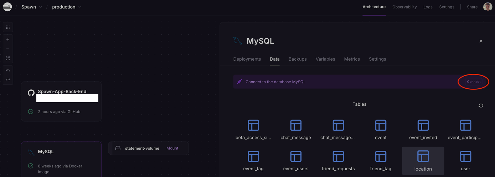
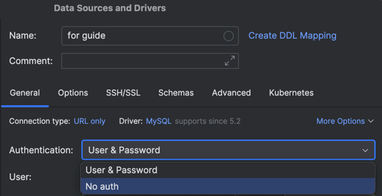

# Connecting to Prod (Hosted) DB Through IntelliJ

1. Create new data source from URL

2. On Railway -> go to our database's container -> "Data" tab -> click "Connect"

3. Click "Public Network" -> copy the first URL

4. Paste that into the IntelliJ connection window

5. Click "no auth" instead of user/pass login

6. Prepend `jdbc:` to the URL and click "test connection"

7. It should work now, and show our DB tables in this tab:

