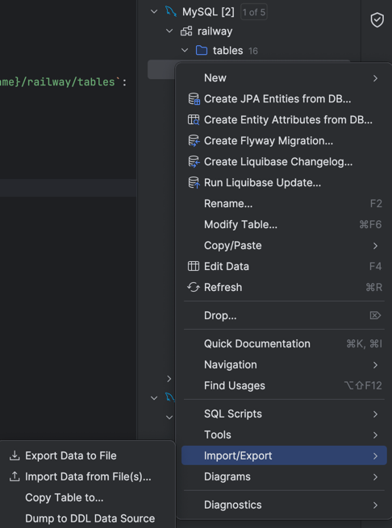
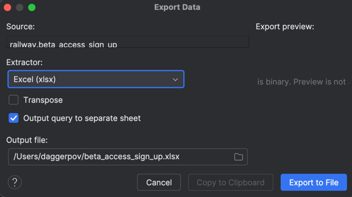

# Exporting DB Data to Excel File

One use case, that I'll use for this guide: beta access sign up emails, for our marketing team.

## Firstly: read `connect-to-prod-db.md`

## Secondly, follow these simple instructions:

1. From IntelliJ's Database panel/tab, expand `{your DB connection name}/railway/tables`:

2. Right-click on the table -> "Import/Export" -> "Export Data to File":

3. You're done with the click of this button

